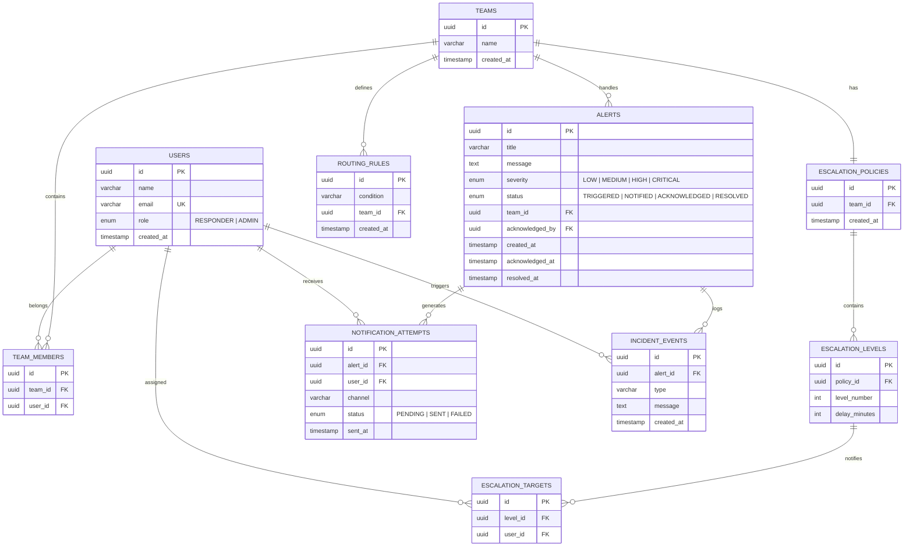

# ER Diagram — Sentinel

## Overview

This Entity-Relationship diagram defines the database schema for the Sentinel incident management platform.  
It models alerts, routing, escalation, notifications, and event logging.

---

