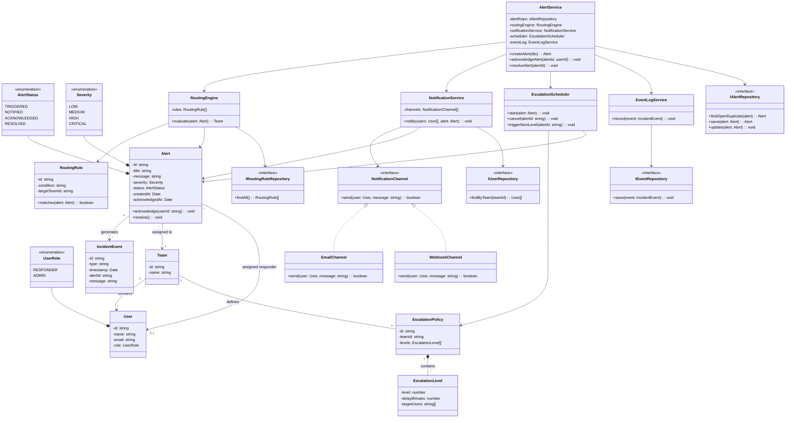

# Class Diagram — Sentinel

## Overview

This class diagram shows the major classes, attributes, methods, and relationships across the Sentinel platform.  
The design follows **Clean Architecture (Controller → Service → Repository)** and applies OOP principles and design patterns such as Strategy, State, and Chain of Responsibility.

---

