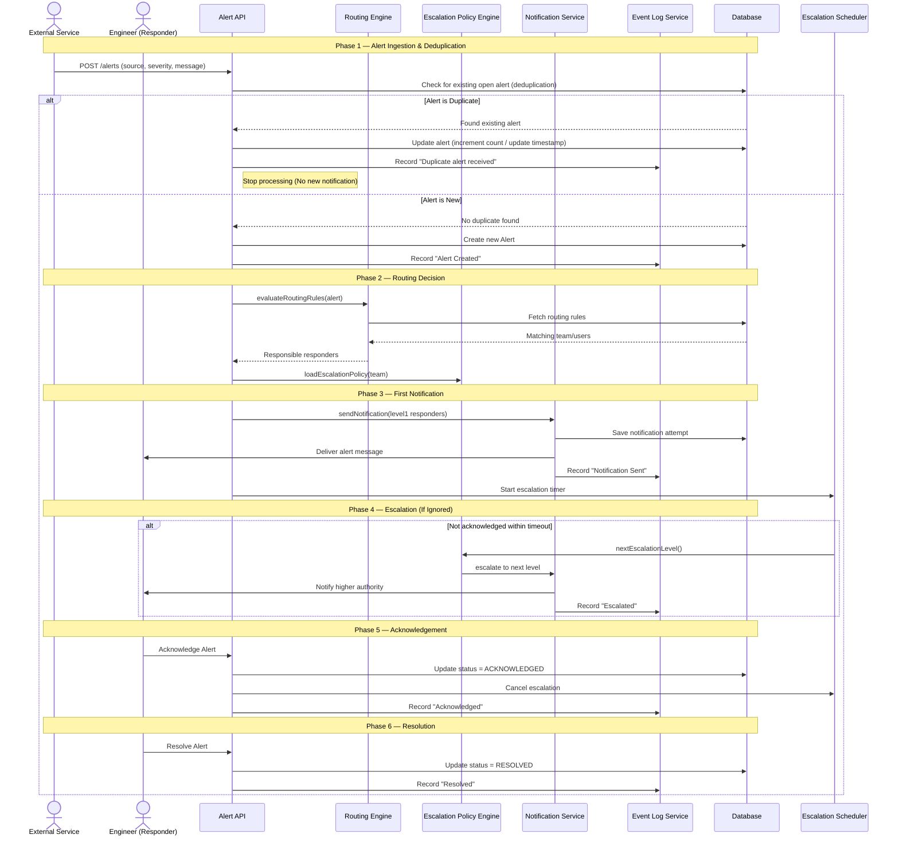

# Sequence Diagram — Sentinel

## Main Flow: End-to-End Incident Lifecycle (Alert → Escalation → Resolution)

This sequence diagram illustrates the complete lifecycle of an incident — from an external monitoring system triggering an alert, routing it to the correct team, escalating if ignored, and finally resolution by an engineer.

---

